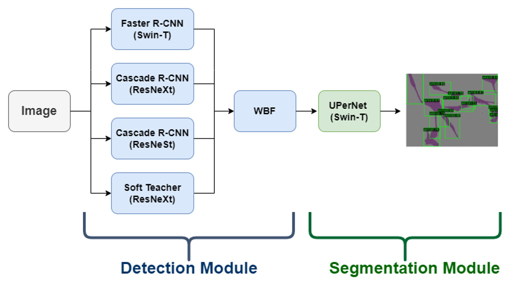

# Multi-Detector Ensemble approach for Instance Segmentation of Neuronal Cells (MDE-CellMask) - Kaggle Sartorius Competition

https://www.kaggle.com/c/sartorius-cell-instance-segmentation

Our implementation is based on MMDetection & PyTorch.

 [-Full report-](https://github.com/Itay-Niv/Multi-Detector-Ensemble-approach-for-Instance-Segmentation-of-Neuronal-Cells-MDECellMask/full_report.pdf)



# Install
1) Download or clone this github folder and name it "main_dir".
2) Download install files: https://drive.google.com/drive/folders/1uNIgD5SsF_yy0DLYc7AFBUxhmKm_JPIP?usp=sharing
3) Place the files in folder main_dir/installs/.


## Data Preparation
1) Download the competition dataset from: https://www.kaggle.com/c/sartorius-cell-instance-segmentation/data
2) Download LIVECell dataset from https://github.com/sartorius-research/LIVECell 
3) Unzip the files as follows:
```
├─ data
├───── LIVECell_dataset_2021
│      ├── images
│      ├── ann_coco_livecell_train.json
│      ├── ann_coco_livecell_val.json
│      └── ann_coco_livecell_test.json
├───── train
├───── train_semi_supervised
├───── train.csv
└───── test
```
4) Crate annotation files for: a) train folder  b) train_semi_supervised folder:
```
Open notebook:   /utils/COCO_dataset_generator.ipynb          (run the notebook as instructed in it).
```

5) Final data folder arangement:
```
├─ data
├───── LIVECell_dataset_2021
│      ├── images
│      ├── ann_coco_livecell_train.json
│      ├── ann_coco_livecell_val.json
│      └── ann_coco_livecell_test.json
├───── train
├───── train_semi_supervised
├───── train.csv
├───── test
├───── ann_coco_sartorius_train_95_5.json
├───── ann_coco_sartorius_val_95_5.json
└───── ann_coco_semi.json
```
6) Place the files inside the data folder in main_dir/data/.

## Notes (before training): 
1) Our soloution use 4 detection models, and 1 segmentation model to train independently in different jupyter notebooks.
2) To modify configurations/parameters, open and modify the config file coressponding to each model's folder according to https://mmdetection.readthedocs.io.
         (For example: main_dir/models/det/det1_cascade_rcnn_resnext/configs/config_det1_cascade_rcnn_resnext.py).
3) Must modify in each config file the following parmaeters (lines 1-11): main_dir, exp_name, wnb_username, wnb_project_name, livecell_or_sartorius (as instructed in it).
4) As explained in our report, we first pretrained each model on the Livecell dataset, to do so, choose in each config file if to train on Livecell dataset or competition dataset.

## Weights

1) Download pretrained weights from: 
         https://drive.google.com/drive/folders/14XtWS7mgV8Snw8Th8vzWny_DadctFqin?usp=sharing
2) Place each weight file in the corresponding model folder. For example, in main_dir/models/det/det1_cascade_rcnn_resnext/pretrained_weights 
* To load our final models' weights, download: 
         https://drive.google.com/drive/folders/14V57zTyR3ICnEkGzEsFkR-qpFkoYxwi2?usp=sharing


## Training
Our soloution is composed of 4 detection models and 1 segmentation model. All models are trained independently from one another in seperate jupyter notebooks. 
```
1) Open notebook:   main_dir/training_scripts/det/det1_cascade_rcnn_resnext.ipynb            (and run the notebook as instructed in it).
2) Open notebook:   main_dir/training_scripts/det/det2_cascade_rcnn_resnest.ipynb            (and run the notebook as instructed in it).
3) Open notebook:   main_dir/training_scripts/det/det3_faster_rcnn_swin.ipynb                (and run the notebook as instructed in it).
4) Open notebook:   main_dir/training_scripts/det/det4_softteacher_faster_rcnn_resnext.ipynb (and run the notebook as instructed in it).
5) Open notebook:   main_dir/training_scripts/seg/seg_upernet_swin.ipynb                     (and run the notebook as instructed in it).
```
## Inference/Test
```
Open notebook:   main_dir/inference_script/inference_det_and_seg.ipynb                    (and run the notebook as instructed in it).
```


The full test folder and its annotations is not available. Hence the final evaluation is preformed by submiting the prediction in Kaggle's competition site.


